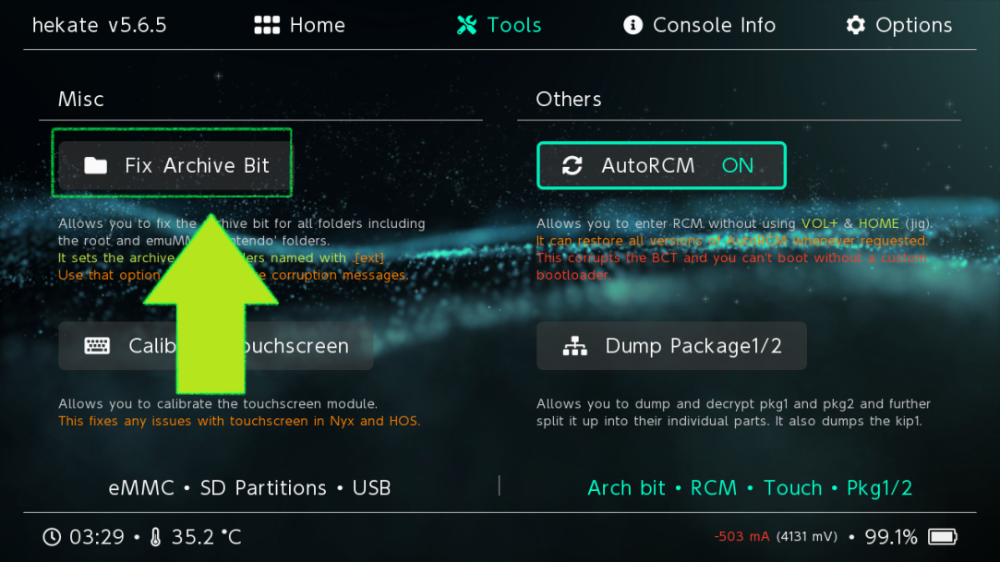

# Atmosphere

1. Download the mod from HERE (not the github link)

2. Extract the files somewhere on your computer.

3. Open your Switch SD folder and drop "exefs" and "romfs" into atmosphere/contents/0100000011D90000/ (Create any folders that do not exist)

4. Go into the exefs folder and move the .ips file (the string changes every build) to /atmosphere/exefs_patches/Luminescent (Once again, create any folders that don't exist.)

5. Boot your Switch into Hekate. Press "Tools" > "Arch bit • RCM • Touch • Pkg1/2" > "Fix Archive Bit". (Images below)

## Notes

- Currently, only Brilliant Diamond is supported
- You must be on update 1.3.0 (Not 1.1.3)
- You must NOT have a folder containing romfs and exefs (the exefs and romfs file must be directly in the 0100000011D90000 folder)

## Not working?

If you have followed all of these instructions and the game still doesn't boot, please use a homebrew file reader such as NX-Shell and navigate to atmosphere/contents/0100000011D90000 and check that romfs and exefs (and the folders within) are displaying as folders as intended.

If they are instead displaying as files please make your own exefs and romfs in the appropriate spot and place the contents inside yourself. Check again in NX-Shell that everything is displaying as folders now.

You may also need to redownload the mod entirely in case of a corruption.

## Fix the Archive Bit

