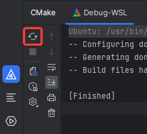

# ExeFS Modding Guide

## Introduction

There are a few main components to exefs modding that you will need to have at least a basic understanding of.

- Using Ghidra/IDA to research
- [ARM opcodes](https://developer.arm.com/documentation/ddi0487/ha/?lang=en)
- Using ExLaunch to compile C++ code

The basic format is to use ghidra to find an offset where we want to inject custom code. We then write C++ code and build it using ExLaunch. This then gives us ExeFS files we can install on our switch or emulator.

## Setup

- [Set up Ghidra](ghidra.md)
- [Set up ExLaunch](exlaunch.md)

## Building

The ExLaunch template has build options for `atmosphere`, `yuzu`, `ryujinx` and `modmanager`. When you build for any of these targets it will output files and folders in the correct directory structure to be dumped into the mods folder. The two actual files that get built (main.npdm and subsdk9) are **the same** no matter which of the targets you build, so generally it doesn't really matter as long as you know where to put them.

### Building with the command prompt

To build your mod files manually through the command prompt, there are a few commands to run. They are detailed below.

```bash
# Configure the cmake project
cmake -G "Unix Makefiles" -DCMAKE_BUILD_TYPE:STRING="Debug" -DCMAKE_INSTALL_PREFIX:PATH="out/install/WSL-GCC-Debug" -DCMAKE_TOOLCHAIN_FILE:FILEPATH="cmake/toolchain.cmake" -Bbuild

# Move to the build directory
cd build

# Build the target you want. Replace <target> with your target.
make RomBase_release_<target>

# Optional: Export the built failes as a zip. Replace <target> with your target.
make RomBase_zip_<target>

# Optional: Send to the Switch using FTP. Replace <target> with your target (Only supports atmosphere and modmanager).
make RomBase_ftp_<target>
```

To build for another target simply replace `<target>` with your build target e.g., `atmosphere`

```bash
make release_atmosphere
```

### Building with CLion

I generally recommend using CLion for writing code on ExLaunch over something like Visual Studio Code as the latter has trouble with the way hooks are defined (and C++ in general, really).

Your toolchain settings should look like this:


- Toolset should be set to your WSL instance.
- CMake should be set to WSL CMake.
- The rest should generally be left as-is unless you know what you're doing.

Your CMake profile settings should look like this:


- Build type should be set to Debug.
- Toolchain should be set to WSL.
- Generator should be set to Unix Makefiles.
- CMake options should be the following:
```bash
-G "Unix Makefiles"
-DCMAKE_TOOLCHAIN_FILE:FILEPATH="cmake/toolchain.cmake"
-DCMAKE_INSTALL_PREFIX:PATH="out/install/WSL-GCC-Debug"
```
- Build directory should be set to `build`.
- Environment should be set to `DEVKITPRO=/opt/devkitpro`.
- The rest should generally be left as-is unless you know what you're doing.

After this is set up, building is very easy!

In the CMake menu in the bottom left, click the "Reload CMake Project" button:



Once it's reloaded, you can select the target you'd like to build from the dropdown menu at the top and click the "Build" button.


## Example Usage

Let's go through an example of disabling the disobeying mechanic.

:::info

This patch already exists in `src/mod/features/badge_check.cpp` if you're looking at the Luminescent fork. For demonstration purposes we'll add it as its own patch. Always make sure you're not duplicating existing hooks when creating patches!

:::

1. Set up your development enviroment as above.

2. Use Ghidra to find the offset to a function where you want to inject your custom code. This is probably going to be the hardest part, we need to look through the code and find the relevant location for our injection.

   1. Lets open ghidra and search through the functions using the Symbol Tree on the left sidebar.
   2. Just from messing around in the files we know `Dpr` is where most game functions are. Within this we know disobeying is a battle mechanic so let's look under `Dpr.Battle.Logic`.  
   3. After a bit of searching around we find a function in the `MainModule` called `Dpr.Battle.Logic.MainModule$$GetMaxFollowPokeLevel` which returns a `uint8_t`. This looks like the function that returns the max obeying level, so let's assume it is and test it.
   4. The function starts at the adress of `71020349e0`, which equates to an offset of `020349e0`.

3. Add your new feature to the `src/mod/features/features.h` header file and call it from main.

    1. Let's add our new feature and call it `disobeying`. Usually the function names that we use are prefixed with `exl_` and suffixed with `_main`.

    ```cpp title="src/mod/features/features.h"
    // Removes the disobeying mechanic.
    void exl_disobeying_main();
    ```

    2. Add a call to this function in `exl_feature_main()` in `src/mod/features/main.cpp` to enable our patch.

4. Create a `.cpp` file in the `src/mod/features` directory which states the offset to inject your code at, and the code to run.

    1. Let's create a new file `src/mod/features/disobeying.cpp`.
    2. At the top of the file, I usually always add this include for feature files:
    ```cpp title="src/mod/features/disobeying.cpp"
    #include "exlaunch.hpp"
    ```
    3. Define a hook to inject code into the wanted function. There are 3 types of hooks in ExLaunch that are detailed [here](hooks.md). For our purposes, we'll want a replace hook:
    ```cpp title="src/mod/features/disobeying.cpp"
    HOOK_DEFINE_REPLACE(Dpr_Battle_Logic_MainModule_GetMaxFollowPokeLevel) {
      static uint8_t Callback(Dpr::Battle::Logic::MainModule::Object* __this) {
        // Setting the obedience threshold to always be Lv. 100.
        return 100;
      }
    };
    ```

    :::info

    How to properly define the type of the `__this` argument is detailed on the [headers](headers.md) page.
    
    :::

    4. Now that the hook is defined, you can install it at the offset where the original function is that we found earlier (`020349e0`). Add the following definition of `exl_disobeying_main` to the bottom of the file:
    ```cpp title="src/mod/features/disobeying.cpp"
    void exl_disobeying_main() {
      Dpr_Battle_Logic_MainModule_GetMaxFollowPokeLevel::InstallAtOffset(0x020349e0);
    }
    ```

5. Build your mod as above.

6. Install and test your new mod on your target platform.

## Next Steps

To accomplish mods that are more complicated you'll need to learn more about AARCH64 opcodes and C++. If you want to access internal functions, you will need to add their offset when defining them as externals. More info on that on the [headers](headers.md) page. When you run into issues, [logging](logging.md) and [debugging](debugging.md) are useful tools to help resolve them.

Check the side bar for more info on these topics.
