# (870) _AC_INDEX_ANIME

## Effect

Animates the actor based on the given animation.

If the second argument is provided, the animation takes two seconds.

## Syntax

```c
_AC_INDEX_ANIME(animation, two_seconds?)
```

| Argument | Description | Types | Required |
| - | - | - | - |
| **animation** | The animation to perform | Float | Required |
| **two_seconds** | Whether the animation should take 2 seconds | Any | Optional |

## Example

```c
anm_dummy:
_AC_INDEX_ANIME(41)
_AC_INDEX_ANIME_WAIT()
_ACMD_END()
```

The above script will make the actor spin around in the air.

## List of animations

| ID | Animation | Preview |
| :-: | - | :-: |
| 1 | Walking animation | 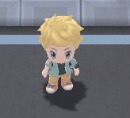 |
| 2 | Running animation | 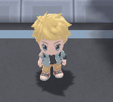 |
| 3 | Look around - left, right, left |  |
| 4 | Idle animation |  |
| 5 | Pull out fishing rod | 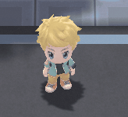 |
| 6 | Hold fishing rod | 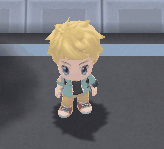 |
| 7 | Release fishing rod | 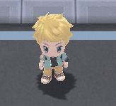 |
| 8 | Pull in fishing rod |  |
| 9 | Open hands |  |
| 10 | Sitting down |  |
| 11 | Stretch out hand | 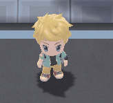 |
| 12 | Kneel down | 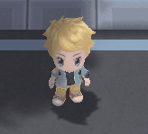 |
| 13 | Raise arm |  |
| 14 | Raise and lower arm |  |
| 15 | Spin around in the air |  |
| 16 | T pose long | 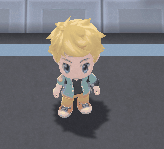 |
| 17 | T pose medium | 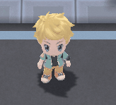 |
| 18 | T pose short | 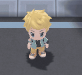 |
| 20 | Bump | 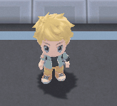 |
| 21 | Float |  |
| 22 | Stumble |  |
| 23 | Stretch |  |
| 24 | Slow walk |  |
| 25 | Pull in fishing rod |  |
| 26 | Shock fade in |  |
| 27 | Shock fade out | 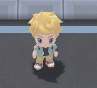 |
| 28 | Swirl Spoon? | 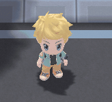 |
| 29 | Hold fishing rod above head |  |
| 30 | Weird run |  |
| 31 | Weird run | 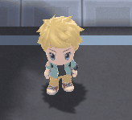 |
| 32 | Watering can start? | 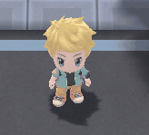 |
| 33 | Watering can end? |  |
| 36 | Pok&eacute;tch start | 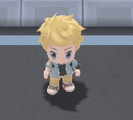 |
| 37 | Pok&eacute;tch end |  |
| 38 | Fall in ground |  |
| 39 | Float out of ground | 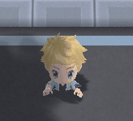 |
| 40 | Jump out of ground |  |
| 41 | Spin around in the air | 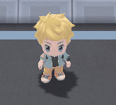 |
| 42 | Lie on the ground | 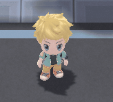 |
| 43 | Spin 180° and plop to ground | 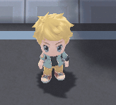 |
| 44 | Stand up |  |
| 45 | Look up | 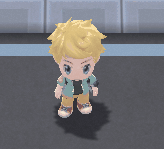 |
| 65 | Slow jump | 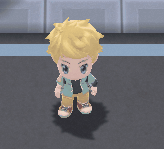 |
| 66 | Slow jump |  |
| 67 | Pull out fishing rod kneeling |  |
| 68 | Hold fishing rod kneeling | 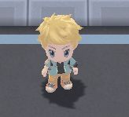 |
| 69 | Release fishing rod kneeling |  |
| 70 | Swirling spoon kneeling? | 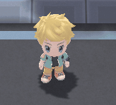 |
| 71 | Put away fishing rod kneeling |  |
| 72 | Pull in fishing rod kneeling |  |
| 73 | Hold fishing rod above head kneeling |  |
| 76 | Flying animation leave |  |
| 77 | Flying animation arrive | 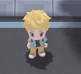 |
| 78 | Pok&eacute;tch kneeling | 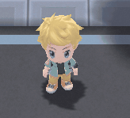 |
| 79 | Pok&eacute;tch kneeling | 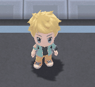 |
| 80 | Pok&eacute;tch kneeling |  |

There might be more. These were all I could find.

If you'd like to contribute any you found, feel free to contact us on Discord!